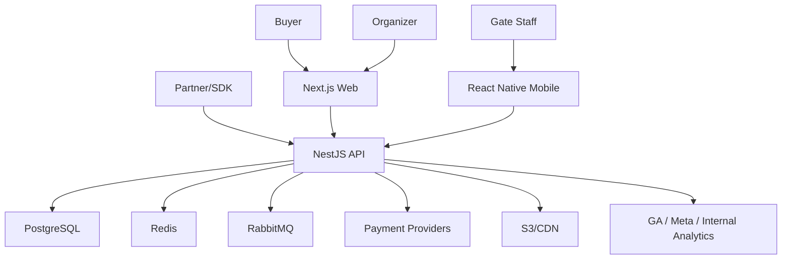
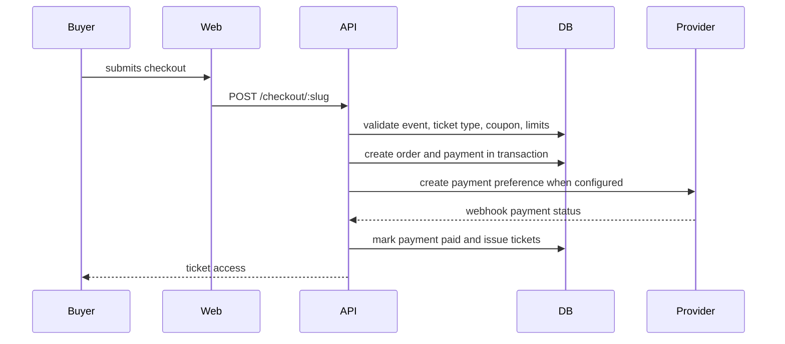
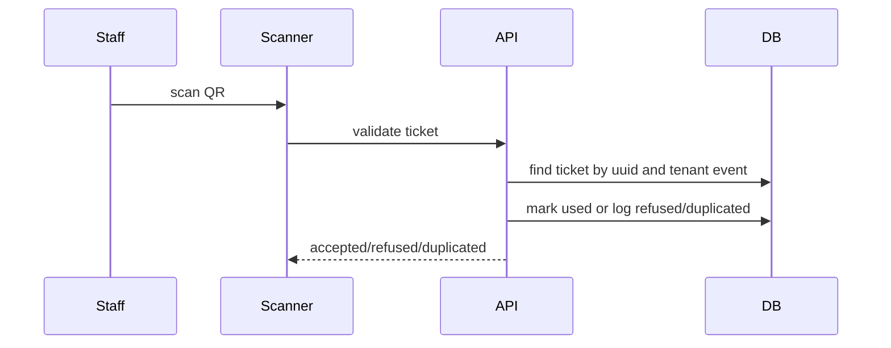
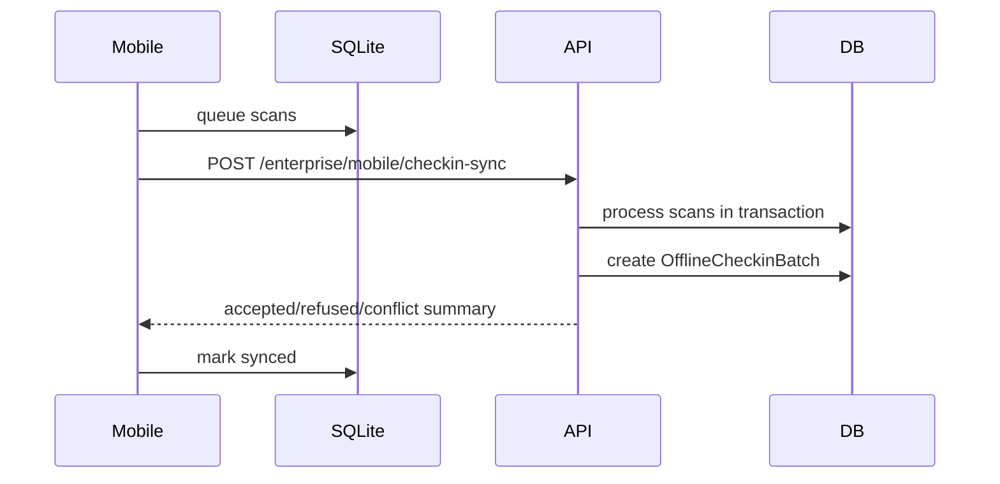

# EventHub Architecture

EventHub is organized as a monorepo with clear separation between web, API, mobile, SDK, shared config and infrastructure.

## System context

## Applications

### `apps/api`

NestJS backend.

Responsibilities:

- authentication and authorization
- tenant isolation
- event management
- ticket inventory
- checkout
- payment state
- ticket issuance
- check-in
- finance
- reports
- enterprise modules
- Swagger/OpenAPI

Layering:

- controllers: HTTP boundary
- DTOs: validation
- services: use cases
- repositories: query composition when needed
- Prisma service: persistence gateway
- guards/middleware/filters: cross-cutting concerns

### `apps/web`

Next.js frontend.

Responsibilities:

- public event discovery
- event detail and SEO pages
- checkout
- buyer area
- organizer dashboard
- enterprise operations dashboard

### `apps/mobile`

React Native/Expo check-in app.

Responsibilities:

- QR scanning
- SQLite offline queue
- online/offline staff operation
- batch sync to API

### `packages/sdk`

TypeScript SDK for partner and white-label integrations.

Responsibilities:

- simple API client
- public event reads
- analytics tracking
- offline check-in sync helper

## Backend modules

Core modules:

- `auth`
- `users`
- `events`
- `tickets`
- `checkout`
- `payments`
- `checkin`
- `finance`
- `dashboard`
- `profile`
- `admin`
- `coupons`
- `team`
- `participants`
- `reports`
- `notifications`
- `webhooks`
- `buyer`
- `audit`
- `cache`

Enterprise module:

- `enterprise`

The enterprise module currently groups new platform capabilities. As traffic and team ownership grow, split it into bounded contexts:

- `white-label`
- `mobile-sync`
- `affiliates`
- `crm`
- `marketing`
- `analytics`
- `public-api`
- `seat-maps`
- `marketplace`
- `ai`
- `security`
- `operations`

## Main request flows

### Checkout

### Check-in

### Offline check-in sync

## Domain boundaries

Recommended aggregate roots:

- Tenant
- User
- Event
- TicketType
- Order
- Payment
- Ticket
- SeatMap
- AffiliateProgram
- CrmCustomer
- Campaign

Rules:

- An `Order` cannot be paid without a valid `Payment`.
- Tickets are issued only after confirmed payment.
- A ticket can be used once.
- A seat cannot be sold if it is blocked or sold.
- Organizer data cannot be queried without tenant scope.
- Financial state changes must be auditable.

## Scalability model

- API and web are stateless.
- PostgreSQL stores system of record.
- Redis is used for cache, rate limits and future seat/inventory locks.
- RabbitMQ is the async backbone for provider calls, email, analytics, fraud and sync jobs.
- CDN serves public pages and white-label assets.
- Workers scale independently by queue depth.

## Architectural risks

- The enterprise module is broad and should be split before multiple teams work on it.
- Some enterprise endpoints accept generic records; stable public APIs need explicit DTOs.
- Public API key/OAuth persistence exists, but production guards and token exchange must be completed.
- Payment webhook signature validation must be mandatory before real payment volume.
- Inventory and seat reservations need Redis/SQL locking under high concurrency.
