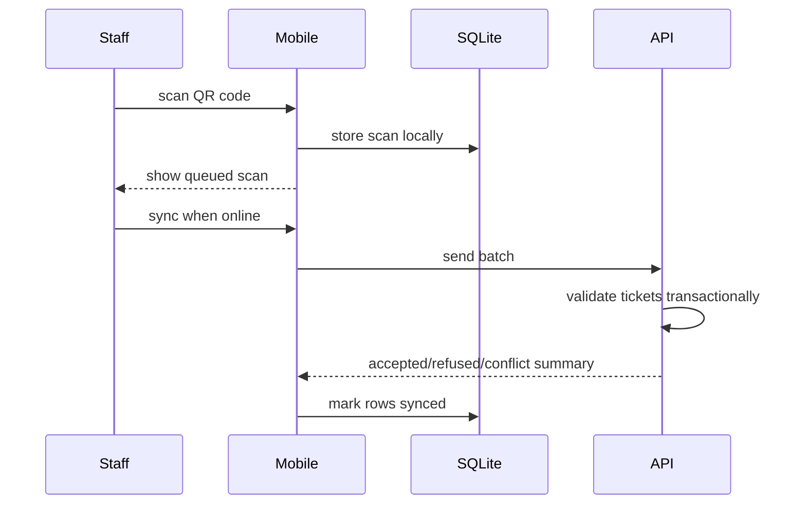

# Frontend and Mobile

## Web app

The web app is a Next.js 15 App Router application in `apps/web`.

Core libraries:

- React
- TypeScript
- Tailwind CSS
- shadcn-style UI primitives
- React Query
- Zustand
- React Hook Form
- Zod
- Recharts
- lucide-react

## Web routes

Public:

- `/`
- `/eventos/[slug]`
- `/checkout/[slug]`

Auth:

- `/login`
- `/register`
- `/forgot-password`

Organizer dashboard:

- `/dashboard`
- `/events`
- `/events/new`
- `/events/[id]`
- `/events/[id]/tickets`
- `/participants`
- `/check-in`
- `/finance`
- `/reports`
- `/team`
- `/coupons`
- `/profile`
- `/enterprise`
- `/admin`

Buyer:

- `/me/ingressos`
- `/me/organizador`

## UX principles

- Dashboard screens should prioritize dense, scannable operational data.
- Public event pages should optimize conversion and trust.
- Checkout must keep buyer friction low and errors clear.
- Check-in must be fast, high contrast and resilient to poor connectivity.
- Enterprise screens should expose readiness, configuration and operational counters without marketing copy.

## UI rules

- Use existing UI primitives in `components/ui`.
- Use lucide icons for actions and navigation.
- Keep cards for contained items and repeated widgets.
- Avoid nested cards.
- Ensure mobile layouts do not overflow.
- Use loading skeletons for remote dashboard data.
- Use semantic labels for forms.

## API client

`apps/web/lib/api.ts` centralizes fetch behavior:

- base URL from `NEXT_PUBLIC_API_URL`
- JSON headers
- bearer token injection from Zustand auth store
- normalized error messages

## Mobile app

The mobile app is in `apps/mobile`.

Purpose:

- Android and iOS check-in application.
- Works offline using SQLite.
- Queues scans locally.
- Syncs batches to `/api/enterprise/mobile/checkin-sync`.

Key files:

- `apps/mobile/App.tsx`: UI, QR scanner, setup and sync actions.
- `apps/mobile/src/offline-checkin.ts`: SQLite queue and sync logic.
- `apps/mobile/app.json`: Expo app config.
- `apps/mobile/eas.json`: build profiles.

## Offline check-in flow

## SEO

Public event pages should include:

- unique title and description
- canonical URL
- Open Graph image
- structured event data
- fast image loading
- crawlable event details

SEO-critical fields already modeled:

- `seoTitle`
- `seoDescription`
- `bannerUrl`
- `startsAt`
- `city`
- `state`
- `category`
