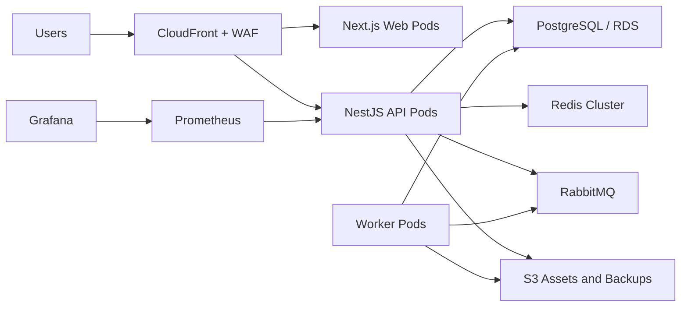

# Infrastructure and Deploy

Event Flow is designed to run locally with Docker Compose and in production on a horizontally scalable cloud platform.

## Local Docker Compose

Services:

- `postgres`: PostgreSQL 16.
- `redis`: cache, rate limits and queue support.
- `rabbitmq`: async workloads and enterprise messaging.
- `api`: NestJS API.
- `web`: Next.js application.
- `prometheus`: metrics scrape.
- `grafana`: dashboards.
- `loki`: centralized logs target.

Start:

```bash
docker compose up -d postgres redis rabbitmq
docker compose up -d api web prometheus grafana loki
```

## Production reference architecture



## AWS mapping

- EKS: API, web and worker workloads.
- RDS PostgreSQL: primary database with PITR and read replicas.
- ElastiCache Redis Cluster: cache, rate limits, sessions and seat locks.
- Amazon MQ or RabbitMQ on Kubernetes: async workloads.
- S3: static assets, white-label uploads, reports and backups.
- CloudFront: CDN and custom white-label domains.
- WAF: managed rules and checkout/auth rate protection.
- ACM: TLS certificates.
- Secrets Manager: JWT secrets, payment credentials and provider tokens.

## Kubernetes

Manifests are in `infra/k8s`.

- `namespace.yaml`
- `api-deployment.yaml`
- `web-deployment.yaml`
- `worker-deployment.yaml`

Production additions:

- Ingress controller with TLS.
- External Secrets Operator or sealed secrets.
- Pod disruption budgets.
- Network policies.
- Cluster autoscaler or Karpenter.
- Separate worker deployments per queue: payments, emails, analytics, fraud, check-in sync.

## CI/CD

GitHub Actions workflow: `.github/workflows/ci.yml`.

Pipeline stages:

1. Checkout.
2. Setup pnpm and Node.js.
3. Install dependencies.
4. Generate Prisma client.
5. Build all workspaces.
6. Build Docker images.
7. Push images when registry secrets are available.

Recommended gates:

- lint
- typecheck
- unit tests
- integration tests
- Prisma migration diff check
- Docker image vulnerability scan
- OpenAPI artifact generation
- deploy to staging
- smoke tests
- production deploy with approval

## Environment variables

Required:

- `DATABASE_URL`
- `REDIS_URL`
- `JWT_ACCESS_SECRET`
- `JWT_REFRESH_SECRET`
- `JWT_RESET_SECRET`
- `APP_URL`
- `API_URL`
- `NEXT_PUBLIC_API_URL`
- `QR_CODE_SECRET`

Enterprise/integration:

- `RABBITMQ_URL`
- `MERCADO_PAGO_ACCESS_TOKEN`
- `AWS_REGION`
- `AWS_S3_ASSETS_BUCKET`
- `AWS_S3_ASSETS_PUBLIC_URL`
- `AWS_S3_BACKUPS_BUCKET`
- `CLOUDFRONT_DISTRIBUTION_ID`
- `ENCRYPTION_KEY_REF`
- `GOOGLE_ANALYTICS_MEASUREMENT_ID`
- `META_PIXEL_ID`

## High availability

- Run at least 3 API replicas across availability zones.
- Run at least 3 web replicas across availability zones.
- Use managed PostgreSQL with automated failover.
- Use Redis Cluster or managed Redis with replicas.
- Use queue workers with autoscaling by queue depth.
- Serve public media and white-label assets from CDN.
- Keep API pods stateless.

## Cost controls

- Use CDN caching for public event pages and assets.
- Use autoscaling for workers instead of overprovisioning.
- Aggregate analytics events before long-term storage.
- Move old backups/logs to cheaper S3 storage classes.
- Use read replicas only when query pressure justifies them.
- Track infrastructure cost per tenant for enterprise pricing.
